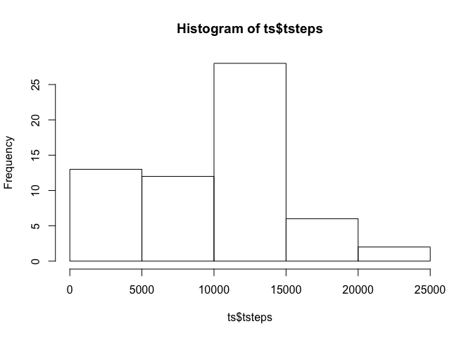
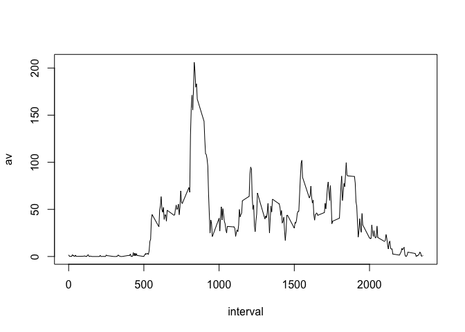
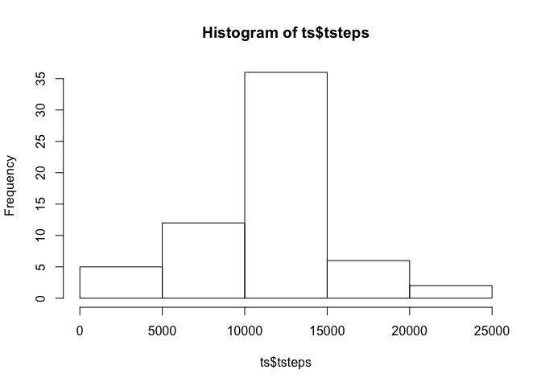
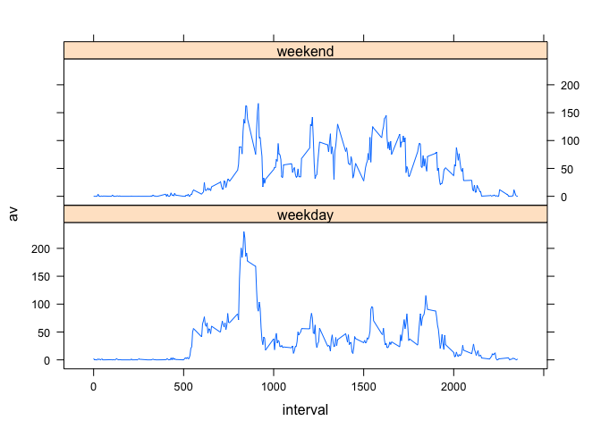

# Reproducible Research: Peer Assessment 1

Load dplyr and lattice library

```r
library(dplyr)
library(lattice)
```

## Loading and preprocessing the data
Unzip data file on demand

```r
if (!file.exists("activity.csv"))
  unzip("activity.zip")
```

Read dataframe

```r
df <- read.csv("activity.csv")
```

## What is mean total number of steps taken per day?
Group and summarise steps per day

```r
total_steps <- function( df )
  {
  gdf <- group_by(df, date)
  ts <- summarise(gdf, tsteps = sum(steps, na.rm=TRUE))
  hist(ts$tsteps)

  ts
}

ts <- total_steps( df )
```

 

```r
mean(ts$tsteps)
```

```
## [1] 9354.23
```

```r
median(ts$tsteps)
```

```
## [1] 10395
```

## What is the average daily activity pattern?
Group and summarise steps per interval

```r
gia <- group_by(df, interval)
sia <- summarise(gia, av=mean(steps, na.rm=TRUE))
plot(sia, type="l")
```

 

Max steps 

```r
sia[which.max(sia$av),]
```

```
## Source: local data frame [1 x 2]
## 
##   interval       av
## 1      835 206.1698
```

## Imputing missing values
Calculate complete cases

```r
mss <- is.na(df$steps)
sum(mss)
```

```
## [1] 2304
```

Replace missing step values by averages

```r
df2 <- df
for (i in 1:nrow(df))
{
  if (is.na(df2$steps[i]))
    df2$steps[i] <- as.integer( sia$av[sia$interval == df2$interval[i]])
}
```

Recalc total step analysis with replaced values

```r
ts <- total_steps( df2 )
```

 

```r
mean(ts$tsteps)
```

```
## [1] 10749.77
```

```r
median(ts$tsteps)
```

```
## [1] 10641
```

## Are there differences in activity patterns between weekdays and weekends?
Set type

```r
type <- vector(length = nrow(df2))
for (i in 1:nrow(df2))
{
  wd <- weekdays(as.Date(df2$date[i]))
  if (wd == "Saturday" | wd == "Sunday")
    type[i] <- "weekend"
  else
    type[i] <- "weekday"
}
df2["type"] <- factor(type)
```

Group data by type and interval

```r
tp <- group_by(df2, type, interval)
tps <- summarise(tp, av=mean(steps))
xyplot(av ~ interval | type, data = tps, type="l", layout=c(1,2))
```

 

